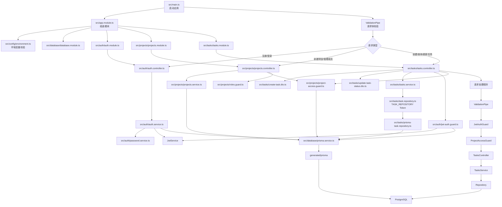

<p align="center">
  <a href="http://nestjs.com/" target="blank"></a>
</p>

[circleci-image]: https://img.shields.io/circleci/build/github/nestjs/nest/master?token=abc123def456
[circleci-url]: https://circleci.com/gh/nestjs/nest

  <p align="center">A progressive <a href="http://nodejs.org" target="_blank">Node.js</a> framework for building efficient and scalable server-side applications.</p>
    <p align="center">
<a href="https://www.npmjs.com/~nestjscore" target="_blank"></a>
<a href="https://www.npmjs.com/~nestjscore" target="_blank"></a>
<a href="https://www.npmjs.com/~nestjscore" target="_blank"></a>
<a href="https://circleci.com/gh/nestjs/nest" target="_blank"></a>
<a href="https://discord.gg/G7Qnnhy" target="_blank"></a>
<a href="https://opencollective.com/nest#backer" target="_blank"></a>
<a href="https://opencollective.com/nest#sponsor" target="_blank"></a>
  <a href="https://paypal.me/kamilmysliwiec" target="_blank"></a>
    <a href="https://opencollective.com/nest#sponsor"  target="_blank"></a>
  <a href="https://twitter.com/nestframework" target="_blank"></a>
</p>
  <!--[](https://opencollective.com/nest#backer)
  [](https://opencollective.com/nest#sponsor)-->

## Description

基于 NestJS 11 与 Fastify 的后端框架学习实验室。项目通过一个持续演进的任务管理场景，系统学习模块化、依赖注入、请求生命周期、持久化、认证授权、横切能力、异步处理和生产化实践。

## Learning workflow

- [系统学习路线](docs/learning-roadmap.md)：学习阶段、业务增量、验收标准与近期迭代。
- [OpenSpec 工作流](openspec/README.md)：以规格驱动每个学习增量的提案、设计、任务和归档。
- [Agent 工作入口](AGENTS.md)：统一导航项目规则、OpenSpec 变更和后续项目级 Skills。

## 代码逻辑文件引用

下面的流程图以任务请求为例，展示应用启动、模块组装、请求守卫、业务服务、Repository 和数据库之间的文件引用关系。



## Project setup

```bash
pnpm install
cp .env.example .env
pnpm db:up
pnpm prisma:generate
pnpm prisma:migrate:deploy
```

本地 PostgreSQL 通过 Docker Compose 暴露在 `127.0.0.1:5433`。停止容器使用 `pnpm db:down`；该命令保留数据卷。

应用启动还需要设置 `JWT_SECRET`、`JWT_ISSUER`、`JWT_AUDIENCE` 和 `JWT_ACCESS_TOKEN_TTL`，本地示例已放在 `.env.example`。任务接口需要先通过 `/auth/register` 或 `/auth/login` 获取 Bearer Token，并在创建任务时提供所属项目的 `projectId`。生产环境应将这些配置注入 Secret Manager 或环境变量，不提交真实密钥。

所有 HTTP 响应都会返回 `x-request-id`，可使用该值关联应用日志；未认证的 `GET /health` 会执行数据库探活并返回服务状态。

### 横切能力接口用法

```bash
# 检查应用及 PostgreSQL 是否可用
curl -i http://localhost:3000/health

# 使用自定义请求 ID，便于在日志中检索本次请求
curl -i -H 'x-request-id: local-debug-001' http://localhost:3000/health
```

请求失败时，响应 JSON 中的 `requestId` 与 `x-request-id` 响应头相同；将该值交给服务端即可定位对应的结构化 HTTP 日志。

## Compile and run the project

```bash
# development
$ pnpm run start

# watch mode
$ pnpm run start:dev

# production mode
$ pnpm run start:prod
```

## Run tests

```bash
# unit tests
$ pnpm run test

# PostgreSQL repository integration tests
$ pnpm run test:integration

# e2e tests
$ pnpm run test:e2e

# test coverage
$ pnpm run test:cov
```

## Deployment

When you're ready to deploy your NestJS application to production, there are some key steps you can take to ensure it runs as efficiently as possible. Check out the [deployment documentation](https://docs.nestjs.com/deployment) for more information.

If you are looking for a cloud-based platform to deploy your NestJS application, check out [Mau](https://mau.nestjs.com), our official platform for deploying NestJS applications on AWS. Mau makes deployment straightforward and fast, requiring just a few simple steps:

```bash
$ pnpm install -g @nestjs/mau
$ mau deploy
```

With Mau, you can deploy your application in just a few clicks, allowing you to focus on building features rather than managing infrastructure.

## Resources

Check out a few resources that may come in handy when working with NestJS:

- Visit the [NestJS Documentation](https://docs.nestjs.com) to learn more about the framework.
- For questions and support, please visit our [Discord channel](https://discord.gg/G7Qnnhy).
- To dive deeper and get more hands-on experience, check out our official video [courses](https://courses.nestjs.com/).
- Deploy your application to AWS with the help of [NestJS Mau](https://mau.nestjs.com) in just a few clicks.
- Visualize your application graph and interact with the NestJS application in real-time using [NestJS Devtools](https://devtools.nestjs.com).
- Need help with your project (part-time to full-time)? Check out our official [enterprise support](https://enterprise.nestjs.com).
- To stay in the loop and get updates, follow us on [X](https://x.com/nestframework) and [LinkedIn](https://linkedin.com/company/nestjs).
- Looking for a job, or have a job to offer? Check out our official [Jobs board](https://jobs.nestjs.com).

## Support

Nest is an MIT-licensed open source project. It can grow thanks to the sponsors and support by the amazing backers. If you'd like to join them, please [read more here](https://docs.nestjs.com/support).

## Stay in touch

- Author - [Kamil Myśliwiec](https://twitter.com/kammysliwiec)
- Website - [https://nestjs.com](https://nestjs.com/)
- Twitter - [@nestframework](https://twitter.com/nestframework)

## License

Nest is [MIT licensed](https://github.com/nestjs/nest/blob/master/LICENSE).
